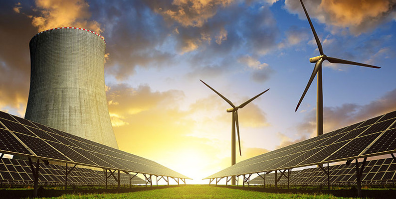

# Electricity Generation Analysis in Europe: 2010–2022

**Electricity Generation Analysis in Europe** A comprehensive data analytics and visualization project exploring and predicting monthly electricity production across European countries between 2010 and 2022.

## **Dataset Content**
* The cleaned dataset contains 120353 monthly records of electricity generation (in GWh) across European countries from 2010 to 2022, broken down by energy source (Hydro, Wind, Solar, etc.). 
* It includes:
#### **Dataset Column Descriptions**
Below is a description of each column in the electricity production dataset:

| **Column Name**         | **Description**                                                                 |
|-------------------------|---------------------------------------------------------------------------------|
| Country                 | Name of the country                                                             |
| Code_time               | A code that represents the month and year (e.g., JAN2010 for January 2010)     |
| Time                    | The month and year in a human-readable format (e.g., January 2010)             |
| Year                    | The year of the data point                                                      |
| Month                   | The month of the data point as a number (1-12)                                  |
| Month_name             | The month of the data point as a string (e.g., January)                         |
| Product                | The type of energy product (e.g., Hydro, Wind, Solar)                           |
| Value                  | Electricity generated in gigawatt-hours (GWh)                                   |
| Display_order          | Order in which the products should be displayed                                 |
| Yeartodate             | Electricity generated YTD (Year-To-Date) for the current year in GWh           |
| Previousyeartodate     | Electricity generated YTD for the previous year in GWh                          |
| share                  | Product’s share of total electricity generation in decimal format (e.g., 0.25)  |

- **Country** : Austria, Belgium, Bulgaria, Croatia, Cyprus, Czech Republic, Denmark, Estonia, Finland, France, Germany, Greece, Hungary, Iceland, Ireland, Italy, Latvia, Lithuania, Luxembourg, Malta, Netherlands, North Macedonia, Norway, Poland, Portugal, Republic of Turkiye, Romania, Serbia, Slovak Republic, Slovenia, Spain, Sweden, Switzerland, United Kingdom.

- **Products(Type of electricity generation)** : Hydro, Wind, Solar, Geothermal, Other renewables, Nuclear, Total combustible fuels, Coal, Oil, Natural gas, Combustible renewables, Other combustible non-renewables, Not specified, Net electricity production, Total imports, Total exports, Electricity supplied, Used for pumped storage, Distribution losses, Final consumption, Electricity trade, Renewables, Non-renewables, Others, Other renewables aggregated, Low carbon, Fossil fuels.

**Note**: Dataset was filtered to include only European countries.

## **Business Requirements**
- Identify and visualize energy production trends across Europe from 2010 to 2022.
- Provide insights into the shift from fossil fuels to renewable sources.
- predict when will renewables surpass non-renewables in Europe
- Predict electricity production for a given country, month, and energy source.

## **Hypotheses and Validation**
- Renewable energy production has increased significantly in Europe since 2010.
    - Validation: This was tested through year-wise trend analyses focusing on Wind, Solar, and Hydro energy generation.
- Renewable sources show an upward trend over the years.
    - Validation: Line plots and detailed trend analyses of renewable source
- Electricity production can be predicted based on time, country, and product type.
    - Validation: A Random Forest machine learning model was developed and tested to predict electricity production using these features.
- Renewable electricity generation will surpass non-renewable generation in Europe within the coming years.
    - Validation: Linear and polynomial regression models were applied to historical aggregated data to forecast the crossover year when renewables exceed non-renewables.

## **Project Plan**
### **High-Level Steps for the Analysis**
1. **Data Collection:**
    * The dataset used in this project was sourced from Kaggle, a reputable platform that hosts a wide range of open datasets contributed by the data science community. 
    * This particular dataset was chosen because it contains comprehensive and relevant information related electricity generation over time 2010 to 2022.
    *  The dataset was downloaded in CSV format.

2. **Data Processing and Cleaning:**
    * After downloading the dataset, I performed several cleaning and preprocessing steps to prepare the data for analysis.
        * Unnecessary and redundant columns were dropped, and remaining columns were renamed for improved readability and consistency.
        * Filter the dataset to include only European countries based on a predefined list. 
        * The separate year and month columns were combined into a single datetime column to facilitate time series analysis.
        * Any missing values (NaNs) in the dataset were filled with zeros to maintain data completeness.
        * Negative values were carefully addressed, while invalid negatives were corrected or handled, negative values in electricity trade rows were retained as they represent exports and have meaningful interpretations.
        * The dataset was checked for potential outliers to ensure data quality and reliability.
    * After these cleaning steps, the processed dataset was saved as 'cleaned_european_countries_dataset.csv'. 
    * This cleaned dataset, with its standardized columns and properly formatted date column, is now ready for exploratory data analysis and modeling.

3. **Exploratory Data Analysis (EDA):**
    * This phase involved thorough analysis of the cleaned electricity generation dataset (2010–2022) for European countries using Python libraries such as pandas, numpy, matplotlib, seaborn, and plotly.
        * Performed descriptive statistics to summarize central tendencies and dispersion of key variables. 
        * Visualized total electricity generation trends over time with line charts and compared the top 5 energy sources using multi line plots.
        * Conducted a detailed comparison of renewable versus non renewable electricity generation through stacked and grouped bar charts.
        * Analyzed trends within renewable sources (solar, wind, hydro) to understand their growth patterns.
        * Generated bar charts showing total generation by country to highlight regional contributions.
        * Computed correlation matrices to investigate relationships among variables like generation values and year to date metrics.
        * Preserved error bars in visualizations to represent data variability and confidence intervals.
        * Manually curated renewable classifications for accuracy in analysis.
    * The insights obtained through EDA laid the groundwork for predictive modeling and powered an interactive Power BI dashboard for stakeholder decision-making.

4. **Modeling and Prediction:**
    * In this project, various statistical and machine learning models were applied to analyze energy production data and forecast future trends.
    * Specifically, linear and polynomial regression models were used to model the growth of renewable and non renewable electricity generation and predict the crossover year when renewables surpass non-renewables.
    
5. **Dashboard Design:**
    * Developed interactive dashboards using Power BI to visualize key insights, trends, allowing stakeholders to explore the data dynamically.

### **Data Management Throughout the Project**

* Data from Kaggle was imported and stored in CSV format and processed primarily in Python using pandas and numpy.
* Data cleaning and preprocessing were scripted for reproducibility and automation.
* Visualizations were created iteratively during EDA using matplotlib, seaborn, and plotly.
* Models were developed and evaluated within Jupyter notebooks for clarity and version control.
* Power BI was used to design dashboards that integrate the processed data and model outputs, providing a user friendly interface for stakeholders.

### **Choice of Research Methodologies**
- **Exploratory Data Analysis (EDA):**
    * Employed to understand data distributions, identify trends, and detect anomalies. Visual tools helped in forming hypotheses about renewable energy growth patterns.

- **Regression Models (Linear and Polynomial):**
    * Chosen to model time based trends in energy production. Linear regression captures straightforward growth, while polynomial regression handles potential nonlinear growth patterns.

- **Random Forest Regression:**
    * Implemented to capture complex, nonlinear relationships in the data that simpler regression models might miss, potentially improving forecast accuracy.

- **Interactive Dashboarding (Power BI):**
    * Used to communicate results effectively to stakeholders through dynamic and intuitive visualizations.

## Mapping Business Requirements to Visuals

| Business Requirement                                                            | Visualization / Technique                                            |
|---------------------------------------------------------------------------------|----------------------------------------------------------------------|
| Identify and visualize energy production trends across Europe from 2010 to 2022 | Line plots, stacked area/bar charts                                  |
| Provide insights into the shift from fossil fuels to renewable sources          | Stacked bar charts, area charts                                      |
| Predict when renewables will surpass non-renewables in Europe                   | Regression models (Linear, Polynomial regression)                    |
| Predict electricity production for a given country, month, and energy source    | Random Forest regression model                                       |

## **Analysis techniques used**
* **Exploratory Data Analysis (EDA):** 
    * Used descriptive statistics and visualizations (line plots, bar charts, area charts) to understand energy production trends and shifts over time.
    * Limitations: EDA is descriptive and does not provide predictive insights or causal inference.
* **Regression Models (Linear and Polynomial):**
    * Applied to model and forecast renewable energy trends, capturing linear and nonlinear growth patterns.
    * Limitations: These models assume certain relationships and may not handle complex interactions or external factors influencing energy production.
* **Random Forest Regression:**
    * Employed for detailed predictions of electricity production by country, month, and energy source, capturing nonlinearities and feature interactions.
    * Limitations: Can be computationally intensive and less interpretable compared to simpler regression models.

### **Structure and Justification of Techniques**
* The analysis was structured progressively: 
    * beginning with EDA to explore and understand data patterns, followed by regression models to forecast overall trends, and finally using Random Forest for granular, accurate predictions. 
    * This approach ensured both interpretability and predictive power, balancing simplicity and complexity appropriately.

### **Data Limitations and Alternative Approaches**
* Data limitations included sparsity in monthly data for some countries and occasional missing values. 
* To address this, aggregation to yearly levels was performed where appropriate, and model complexity was adjusted to prevent overfitting. 
* Missing data was handled via imputation to maintain data quality.

### **Use of Generative AI Tools**
* Generative AI tools assisted by suggesting analysis approaches, generating code snippets for data cleaning, visualization, and modeling, and optimizing code efficiency. 
* They supported design thinking by offering alternative perspectives and helped accelerate development while ensuring best coding practices.

## **Ethical considerations**
### **Data Privacy, Bias, and Fairness :**
* The dataset used contains aggregated energy production data at the country and year level, which does not involve any personal or sensitive information, thereby minimizing data privacy concerns. 
* However, potential biases could arise from uneven data quality or coverage across different countries and time periods, which might affect model fairness and generalizability.
### **Addressing Legal and Societal Issues :**
* To mitigate bias and ensure fairness, data cleaning steps included careful handling of missing or incomplete data to avoid skewed results. 
* All data sources used are publicly available and compliant with legal and ethical standards. 
* Insights were communicated transparently to avoid misinterpretation or misuse. 
* The project respects environmental and societal implications by focusing on promoting renewable energy awareness and supporting informed decision making.

## ***Dashboard Design**
**Note:**
You can access the electricity_production_pverview_in_europe_dashboard.pbix in the dashboard folder. Please download the file from this folder to view and interact with the dashboard.

### Dashboard Pages and Content
* **Cover Page:**
    * This page features the dashboard title and key objectives. It also includes project Description.
* **Electricity Generation Overview:** 
    * This page provides a high-level summary of electricity production across Europe with the following visuals and interactive elements.
    * Map Visual: Displays total electricity generation by country, offering geographic insights into production distribution.
    * Column Chart: Shows total electricity generated by each country, allowing easy comparison.
    * Donut Chart: Represents the breakdown of total electricity generated by different energy types (renewable and non-renewable).
    * Cards:
        * Share of renewable energy as a percentage of total production.
        * Total electricity generated across all countries.
    * Year Slicer: Enables filtering data by year from 2010 to 2022, allowing users to explore trends over time interactively.

* **Breakdown by Energy type:**
    * This page provides detailed insights into electricity production by energy source with the following visualizations and controls.
    * Stacked Column Chart: Visualizes the count of different energy types, showing the composition and contribution of each type.
    * Clustered Column Chart: Displays the total electricity generated by each product/energy source, enabling side by side comparison.
    * Slicers:
        * Country slicer to filter data by selected countries.
        * Year slicer to filter data by year, allowing users to focus on specific time periods.
    
* **Trend over Time:**
    * This page features a line chart showing the total electricity generated over time, broken down by electricity generation source.
    * Users can interactively filter the data using slicers for:
        * Year
        * Energy type
        * Country
    * This setup allows detailed exploration of how energy production trends have evolved across different sources and regions from 2010 to 2022.

* **Year on Year Comparison:** 
    * This page compares electricity generation performance across years with the following visualizations.
    * Clustered Column Chart: Displays total electricity generated over time, enabling comparison between different years.
    * Area Chart: Shows Year-to-Date (YTD) and Previous Year-to-Date electricity generation trends, making it easy to track annual changes and growth patterns.
    * Slicer: Country name slicer to filter and analyze the data for a specific country.

### **Iterative Development and Feature Updates:**
* During development, some visualizations were refined based on user feedback and data exploration.

### **Communication of Data Insights:**
* The dashboard was designed with both technical and non technical audiences in mind. 
* For technical users, detailed charts and statistical summaries provide in depth analysis. 
* For non technical stakeholders, simplified visualizations, KPIs, and clear annotations highlight key messages. 
* Interactive elements enable users to explore data at their own pace and according to their interest.

## **Unfixed Bugs**
### **Granular Hourly or Daily Data Unavailable :**
* Description: The dataset only contains annual electricity generation data, which limits the ability to analyze seasonal or monthly trends.
* Reason Unfixed: This limitation comes from the source dataset, and no public API with historical hourly/daily breakdowns for all European countries was identified during this project.
### **Knowledge Gaps Identified & Addressed :**
* Predictive Modelling in Jupyter + Dashboard Integration: Learned how to export predictions from Python to CSV and then connect them to Power BI for visualization.
* Advanced DAX Calculations: Initially, complex Year-to-Date (YTD) and Previous Year-to-Date measures were challenging. Addressed by studying Microsoft documentation and using example formulas from the Power BI community.
    
## **Development Roadmap**

### Challenges Faced & Strategies to Overcome Them :**
* Handling Large and Complex Dataset: Managing diverse energy production data across many countries, years, and energy types was complex. To overcome this, I used pandas for efficient data manipulation and filtering.
* Integrating Machine Learning Results into Power BI: Exporting predictions and combining them with historical data for visualization required careful data formatting. Saving predictions as CSV files and importing them into Power BI ensured smooth integration.
* Visualizing Complex Trends Effectively: Selecting appropriate charts to communicate energy trends clearly to both technical and non technical audiences required iterative dashboard design and peer feedback.

### **Future Skills and Tools to Learn :**
* Clustering and Unsupervised Learning: Learn techniques such as KMeans, hierarchical clustering, and DBSCAN to group countries or energy sources based on similarity in consumption patterns or production behavior. This can uncover hidden insights and help tailor energy policies.
* Enhanced Power BI Features: Deepen skills in DAX for custom calculations and advanced interactivity, and explore Power BI deployment options and security features.
* Generative AI for Data Science: Leverage AI tools to assist with code optimization, exploratory data analysis, and generating narratives from data insights.

## **Main Data Analysis Libraries**
* **Pandas**: Used for data loading, cleaning, filtering, aggregation, and manipulation.
* **NumPy**: Utilized for numerical operations and array handling, especially preparing data for machine learning models.
* **Matplotlib, Potly & Seaborn**: Used to create visualizations like line plots, histograms, and scatter plots to explore and communicate trends.
* **Scikit-learn**: Applied for building machine learning models such as linear regression, polynomial regression, and random forest. Also used preprocessing tools like one-hot encoding and scaling within pipelines.
* **Power BI**: Although not a Python library, Power BI was essential for designing interactive dashboards to visualize data.

## **Credits** 
### **Content**
* Dataset sourced from Kaggle : [Dataset Link](https://www.kaggle.com/datasets/ccanb23/iea-monthly-electricity-statistics/data)
* Machine learning techniques, data processing methods, and visualization techniques inspired by tutorials on the LMS platform, Scikit-learn documentation, and with the help of ChatGPT and GitHub Copilot
* Dashboard design concepts based on tutorials from LMS content, YouTube videos, and ChatGPT

### **Media**
* Plots and charts created using Matplotlib, Seaborn, and Plotly libraries
* The image used in the dashboard design was sourced from [Image Link](https://www.google.com/search?sca_esv=6181e4a68536525f&sxsrf=AE3TifOYjyvZptaUowVqjwC_QT_6tsB96g:1754557017991&udm=2&fbs=AIIjpHxU7SXXniUZfeShr2fp4giZ1Y6MJ25_tmWITc7uy4KIeoJTKjrFjVxydQWqI2NcOhYPURIv2wPgv_w_sE_0Sc6Q_7Pv7l13oPoHoSfb2CeJ8hufYaACclghvGZKCXsCg1DTOZFCyYebYhQbL-InafMNEZ8_MRL_8aSJaTkjJmmJKj0q_Z0IIoeSGKm4VIXdeEmjOxoT&q=electricity+photos+download&sa=X&ved=2ahUKEwjGr66eqviOAxVkAtsEHc42JKQQtKgLegQIEhAB&biw=1536&bih=730&dpr=1.25#vhid=gLWxvLKjzNhOcM&vssid=mosaic).
* The image used in the README file comes directly from the dataset source link on Kaggle.

### **Extra Help**
* Gratitude to ChatGPT for brainstorming ideas and Copilot for assisting with code optimization.

## **Acknowledgements**
* I would like to sincerely thank my instructors who provided valuable guidance and feedback throughout this project.

